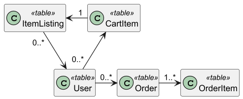

# Quantum Mart Database Overview

----

## Domain Summary
The tables for Quantum Mart are meant to function as a way to simulate a shopping website. Users can sell and purchase items 
listed based on the information stored.

## Table Summaries
### Users
When a client registers an account with the service, their credentials and other relevant details are stored here.

### Item Listings
Displays information for products which are being sold.

### Orders
Parent identifiers for purchases made by users when checking items out of their carts.

### Order Items
Cart items associated with an order are stored here. They maintain data on the original purchase information, such as listing title 
and price.

### Cart Items
A volatile table that holds items users have in their carts.
